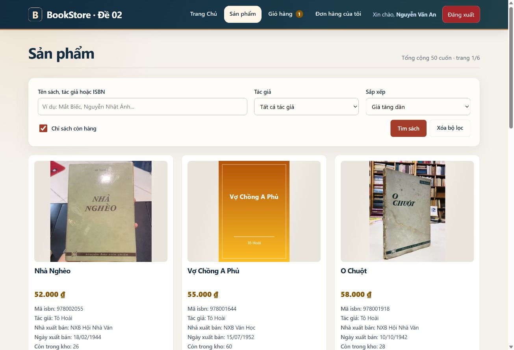
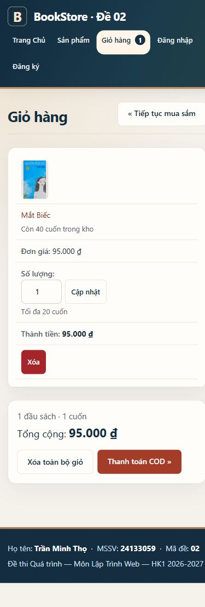
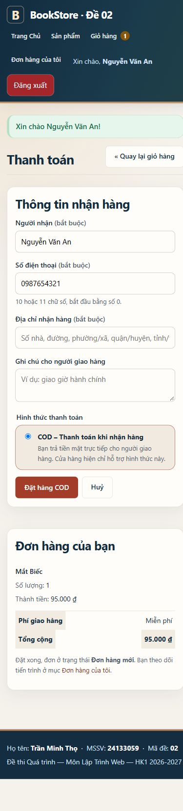
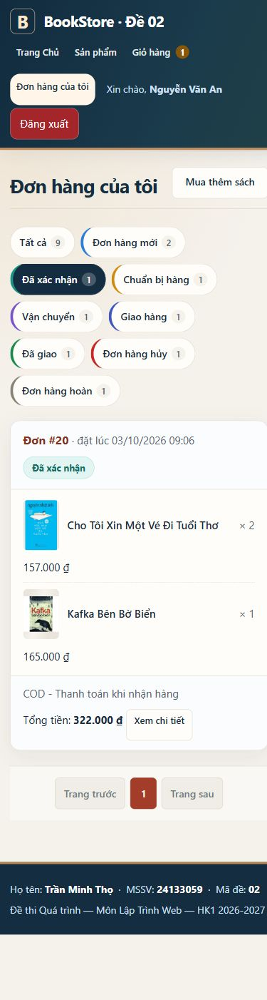

# Đối chiếu yêu cầu và cách kiểm tra

Trần Minh Thọ — 24133059 — BookStore, đề 02.

## Vai trò User

| Yêu cầu | Cách kiểm tra trên web | Mã nguồn / dữ liệu |
|---|---|---|
| Thêm giỏ | Vào Sản phẩm hoặc Chi tiết sách, bấm Thêm vào giỏ; chưa đăng nhập vẫn dùng được | `CartAddServlet_24133059`, `CartService_24133059` |
| Sửa số lượng | Mở Giỏ hàng, sửa và bấm Cập nhật; phạm vi 1–min(kho, 20) | `CartUpdateServlet_24133059`, `cart.jsp` |
| Xóa | Xóa một cuốn hoặc Xóa toàn bộ giỏ; thông báo sau thao tác | `CartRemoveServlet_24133059` |
| Giới hạn và thay đổi kho | Giảm kho trong SQL rồi tải lại giỏ; giỏ tự điều chỉnh và thông báo. Giá đổi trước COD yêu cầu kiểm tra lại | `CartService_24133059`, `OrderService_24133059` |
| Đặt COD | Đăng nhập, điền thông tin nhận hàng, bấm Đặt hàng COD; xem mã đơn và tổng tiền | `CheckoutServlet_24133059`, `OrderDao_24133059`, `checkout.jsp` |
| Đơn hợp lệ | Ghi đơn và chi tiết, trừ kho trong cùng transaction; xóa giỏ chỉ sau khi thành công | `orders`, `order_detail`; hóa đơn lưu tên/giá tại thời điểm mua |
| Lịch sử của từng người | Vào Đơn hàng của tôi; người khác không xem/hủy được đơn bằng cách thay mã URL | `OrderHistoryServlet_24133059`, `OrderDetailServlet_24133059`, `OrderCancelServlet_24133059` |
| Tám trạng thái | Chọn lần lượt tám bộ lọc; có số lượng đơn, chi tiết và tiến trình tương ứng | `OrderStatus_24133059`, `orders.jsp`, `order-detail.jsp` |
| Đổi trạng thái bằng SQL | Mở [script demo](../database/04_order_status_demo.sql), điền `@orderId` và `@newStatus`, chạy rồi F5 web | Script đồng bộ kho khi hủy/hoàn hoặc khôi phục; chạy cùng trạng thái không cộng/trừ kho lần nữa |

08 mã: `NEW`, `CONFIRMED`, `PREPARING`, `SHIPPING`, `DELIVERING`, `DELIVERED`, `CANCELLED`, `RETURNED`.
Khách tự hủy qua web khi đơn còn `NEW`; các trạng thái khác được đổi trong database theo đề.

## Chức năng bài kiểm tra gốc

| Nội dung | Hiện thực |
|---|---|
| Kiến trúc | Servlet Controller → interface/Service → interface/DAO/JDBC; Java theo hậu tố `_24133059` |
| Giao diện chung | SiteMesh 3, decorator riêng User/Admin, header/footer có họ tên, MSSV, mã đề |
| Xác thực | Đăng ký + OTP 6 số, hết hạn theo cấu hình, giới hạn 5 lần nhập sai/mã, gửi lại sau 60 giây; đăng nhập xoay session và giữ giỏ khách |
| Trang chủ | Gom theo tác giả, từng tác giả có 3 sách/trang và phân trang độc lập |
| Chi tiết và review | Thông tin sách, số đánh giá, form chỉ gửi khi đăng nhập; gửi lại cập nhật đánh giá của mình |
| Quản trị | Xem/thêm/sửa/xóa sách, chọn tác giả, ảnh bìa; filter chặn User truy cập trực tiếp |
| Database | Giữ 5 bảng gốc; thêm `orders`, `order_detail`. Giá lưu bằng nghìn đồng; giữ kiểu mật khẩu theo cấu trúc đề |

## Cải thiện trải nghiệm và tiêu chuẩn web

- Tìm theo tên sách/tác giả/ISBN; lọc tác giả, còn hàng; sắp xếp giá/tên. Truy vấn có tham số, sắp xếp theo danh sách cho phép; giữ bộ lọc khi phân trang/thêm giỏ.
- Giỏ và hóa đơn chuyển sang từng khối trên điện thoại; tiến trình đơn xếp dọc. Đã kiểm tra 320, 390 và 1320 px.
- HTML `lang="vi"`, vùng điều hướng, skip link, focus rõ, ô nhập có label; `autocomplete`, `inputmode`, `aria-describedby`, `aria-invalid`; thông báo lỗi có liên kết tới ô cần sửa.
- Nút chính tối thiểu 44 px; hỗ trợ giảm chuyển động; giao diện và nội dung tiếng Việt. JavaScript bổ trợ hiện/ẩn mật khẩu, giữ vị trí khi thêm giỏ và báo đang gửi COD; thao tác chính vẫn là form HTML.
- Mọi POST kiểm tra CSRF theo session. Đăng xuất/gửi lại OTP dùng POST; cookie HttpOnly; CSP, chống nhúng iframe; trang có session không cache, ảnh bìa có ETag/304.
- SMTP thật đọc từ môi trường/file ngoài WAR, không commit mật khẩu. Chế độ demo hiển thị rõ; SMTP đã cấu hình nhưng lỗi gửi sẽ báo lỗi, không in mã thật ra log.

Tham chiếu: [WCAG 2.2](https://www.w3.org/TR/WCAG22/), [thông báo lỗi form](https://www.w3.org/WAI/tutorials/forms/notifications/),
[OWASP CSRF](https://cheatsheetseries.owasp.org/cheatsheets/Cross-Site_Request_Forgery_Prevention_Cheat_Sheet.html).
Đây là đối chiếu các tiêu chí đã kiểm tra, chưa phải chứng nhận tuân thủ toàn bộ WCAG hoặc đo Core Web Vitals trên môi trường thật.

## Minh chứng và kiểm thử

[Báo cáo và lệnh chạy lại](kiem-thu-user-2026-10-05.md): 19 ca nghiệp vụ + 12 ca HTTP/SQL, tổng 31 ca đạt khi bật cả kiểm thử OTP demo.
Kiểm thử tạo dữ liệu riêng và dọn sau mỗi ca; không dùng đơn thật để thử hủy/xóa.
SMTP thật cần cấu hình và kiểm tra hộp thư riêng; ca OTP tự động chạy chế độ console.

| Giỏ mobile | Thanh toán mobile | Lịch sử lọc trạng thái |
|---|---|---|
|  |  |  |

Nộp link repository lên UTeXLMS theo yêu cầu môn học. Các bài tập 3–9 cần nộp bổ sung theo tài khoản LMS của sinh viên, không được suy ra từ project này.
